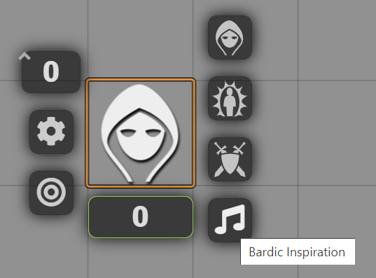
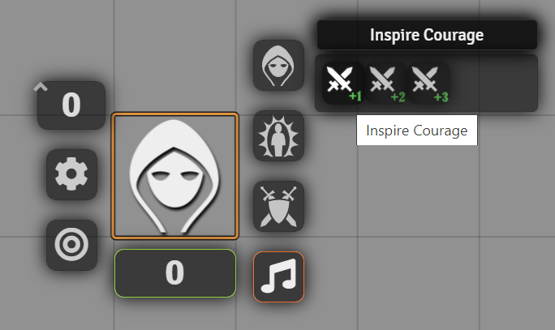

# pf2e-bardic-inspiration

Adds a new sub-menu to the token HUD for bardic inspiration.

Selecting the sub-menu will open a menu similar to the status effects screen. Mousing over the effect options will cause a title to appear with the effect name.

The currently supported effects are:
- Inspire Courage
- Inspire Defense
- Inspire Heroics (Courage, success and critical success)
- Inspire Heroics (Defense, success and critical success)

Selecting an effect option that is inactive (has no yellow border) will attempt to apply it to the character. It will also attempt to cancel out other similar effects. For example, selecting `Inspire Courage` will attempt to deactivate `Inspire Courage +2` and `Inspire Courage +3`. <b>The effects will be applied for an unlimited duration, so they must be manually turned off during combat.</b>

Selecting an effect option that is active (has a yellow border) will attempt to cancel the effect if it is active.